# Halo History

My Website is designed to Introduce and Reinform possible customers of the Halo Franchise. The Site will work as a historical look over the franchises 20 years and encourage more people to get interested and involved in the series. I will use different forms of media such as Images and Video to sumarise more information in an entertaining format for each game in the series. I will also offer a newsletter sign up form, anyone who signs up will recieve weekly updates regarding the newest game yet to be released. It will also provide different story related facts and value beyond just news.

## UX

As stated by the introduction, the site will aim to draw in people to gain interest in the Halo franchise. To do this, the site will use a simple homepage to encourage new users to find out more. At the same time it will be easy for pre-existing users to find the content that they may be interested in. The Games page will make it easy to digest simple information about each game. Using YouTube embeded trailers I will also allow users to watch a sumarised version of each game to provide further content.

The colour scheme is based on a simple white and deep blue to contrast the text for ease of reading. The Header will use this variation of white as the primary colour and all the text contained within it shall be blue. This will keep the heading at the central focus point and allow easy navigation. The rest of the sites content will rely on the deep blue in the background and allow bright text to be easily noitced and read. I used the Wave Evaluation tool to ensure the tones of each colour worked appropriatly for all users.

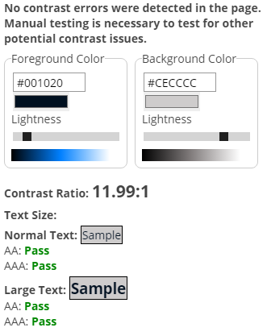

I have included wireframes and my sites main pages bellow to detail the proposed structure.

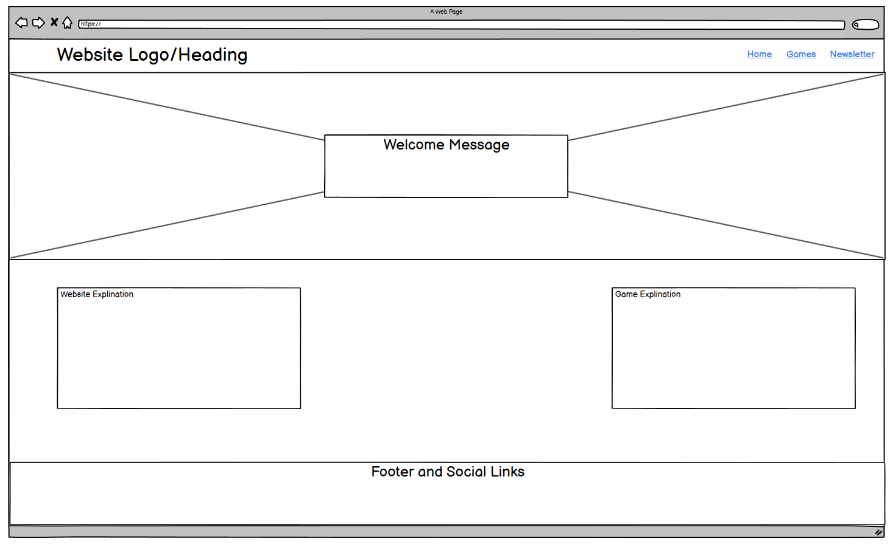
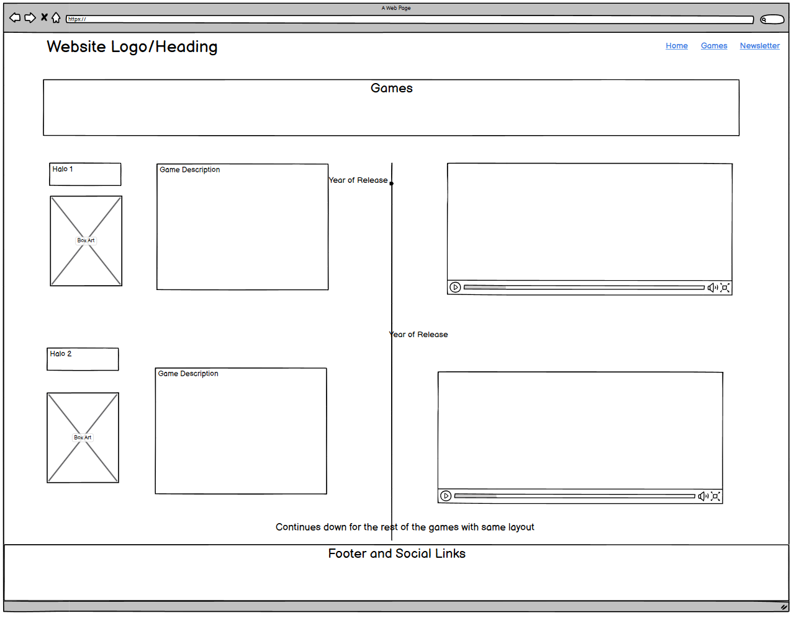
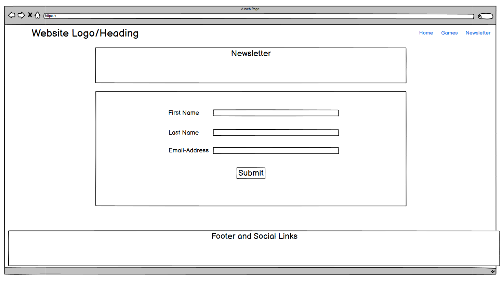

After the creation of my site I kept as close to my wireframes as possible. However when making the games page I ran into a lot of formatting issues. This made it very difficult to display a trailer, images and all the game descriptions in a mobile responsive way. To get around this I turned the entire section into solid content blocks which would allow an easy flow of Title->Description->Trailer. I also opted to include a description of the newsletter, making the content more clear to new users.

User Stories as followed:

### New Users

* I am wanting to learn what Halo is.
* I am interested in the history and timeline of the games.
* I am wanting to see what each game looks like and the story it presents.

### Returning User

* I am checking back for any updates regarding the newest game
* I am wanting to sign up for the newsletter to get further information

## Features

## Existing Features

### Index/Home Page

#### Nav Bar

My Navigation bar consists of an unorderd list that has been aligned to the correct space on the screen using flexbox.

The Nav bar will allow easy navigation across all pages of the site. It uses a simple active class to always inform the user what page they are on. It uses a similar class to also show an underline when a new page is hovered over. It exists on every page of the site, negating the need to use the back button at all. The logo can also be clicked from any page to return the user back to the homepage.

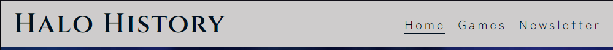

#### Hero Image

When users load into the main page for the first time they will be greeted by a welcome message. It is highlighted by using a hero image that has been blurred. By being blurred it will make the text stand out. It features a button that will directly link a user to the main content of the website. By doing this I'm allowing returning users to quickly find what they are looking for.

#### About Section

The Main about section on the home page will provide users with breif explinations of the sites intention. By doing this I am aiming to keep new users informed without overwhelming them with information. One block of text is directly to explain the site and the content included. The Second will explain the sites content further to pique interst.

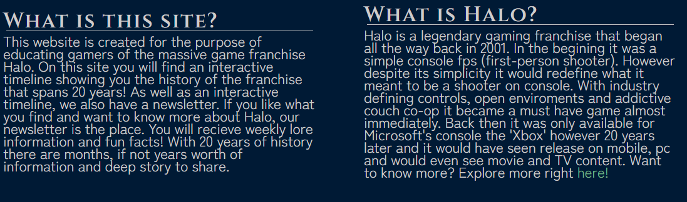

#### Footer

The site has a footer that exists on every page of the website. It contains social links for Facebook, YouTube and Twitter. This will allow users to access thhe social media links from anywhere on the site. It will also open in a new tab to not take users away from the site.

#### Timeline

The games page features a timeline that features a content block for each game. Each block has the title of the game, a brief description and a trailer presented through a YouTube video. I have configured the code to allow each block to scale correctly on mobile and tablet devices. The YouTube video can only be played when the user chooses. The user also has the option to watch the video in another tab via YouTube.

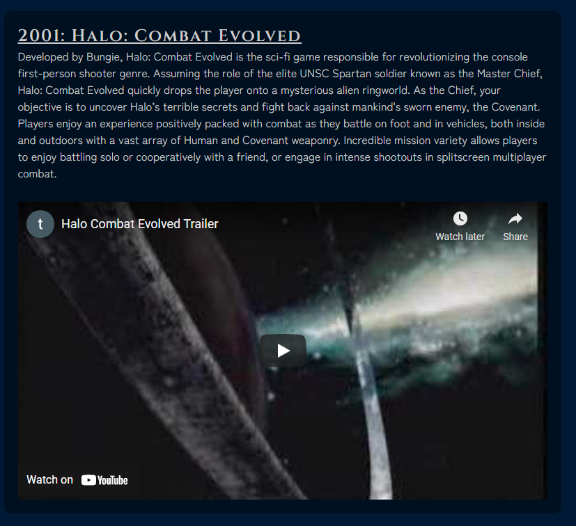

#### Newsletter

The Newsletter page contains a form allowing users to sign up for weekly emails. The newsletter content is explained in a breif description above the form. This ensures that users know exactly what they are signing up for in advance. The form also requires that users fill in the necessary fields, it cannot be submitted without it. When submitted the user is given visual feedback by displaying a message saying the information was susccesfully sent.

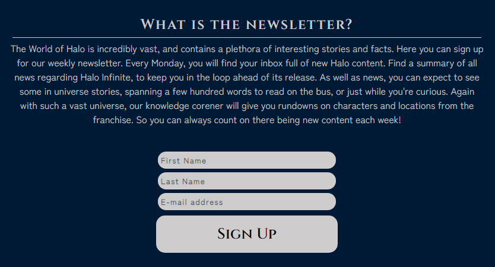

## Future Plans

Add new pages to detail other elements of the franchise, such as sound/books/movies.

Expand current timeline to include the spin offs from the main games and feature a way to navigate between them.

Create a sound page which features a daily song to be featured. Will automatically refresh.

Add interactive gallery to each games timeline block. Allowing users to see further information while maintining mobile responsiveness.

Create a database containing all key knowledge on the franchise. Almost as a mini wiki that can be referenced in text for further reading.

## Testing

I ensured that all the web pages would function correctly on mobile and tablet devices. I also tested for different screen resolutions on desktop. During testing I had trouble with the main home page and used many different media queries to ensure it would display correctly. The main way I tested this was using the responsive window option on Chrome Dev Tools. This allowed live experimentation on different devices and resolutions. Because of this my site is fully function from a minimum screen size of 320px wide.

After this I used W3C validator for HTML and Jigsaw Validator for CSS. This would further ensure there were no errors in my code. The results of those tests can be seen bellow:

Home Page / Index:

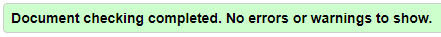

Games:

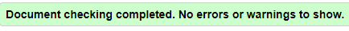

Newsletter:

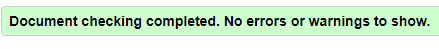

Form Success Page:

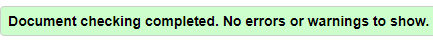

CSS:

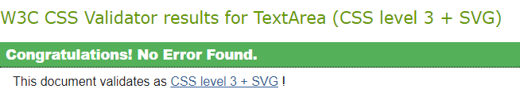

### External Links

I have also ensured that all links present on my website such as Social Media and YouTube open in a new tab. I did this by using the target _blank attribute where necessary. YouTube videos however give the user the option to view them in the site or on YouTube.

### Chrome Dev Tools

During development I relied heavily on dev tools to make live adjustments to the site. This allowed me to make small changes without effecting my code and needing to reverse engineer any mistakes. Using dev tools I was also able to view my site across a number of different resolutions and screen sizes. This helped me identify where my site may need to be changed to work correctly.

### Lighthouse Dev Tools

I was able to use Lighthouse from Chrome Dev Tools throughout development to ensure my Website was hitting my goals. I was able to ensure best practices were being used and that my website performance was high scoring. From the screenshot bellow you can see that SEO and Accesability was also greatly considered in site production.

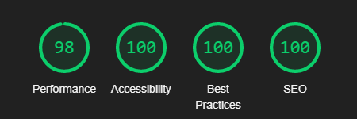

## Deployment

### Site Creation

To begin creating my website I used the Code Institute template by navigating [here](https://github.com/Code-Institute-Org/gitpod-full-template) and clicking "Use this Template".

Once this was done I was able to simply create a new repository from the template and add it to my profile. I named my respository and clicked the create repository from template button.

### Site Deployment

The Steps to Deploy my site were as followed:

1. Log into GitHub and find my site repository
2. Locate the repository settings button located above the repository content and click on it.
3. Scroll down to the GitHub Pages section.
4. Change the source drop down menu from "none" to "main".
5. Click Save and await site deployment using the provided link to access site once it was live.

## Technologies used

HTML

CSS

Google Fonts

Gitpod

Wave Evaluation Tool

Github

## Bugs

During early development I had incorrectly assigned the list-style for my navigation in the wrong area. It was only when resizing to test responsiveness I realised it was there but hidden as it was the same colour as thhe background. I was able to fix this by moving the list style rule from the #controls ul to #controls li.

For some duration my footer text was not on one line. I was unable to find out why, I then discovered that the divs representing the content blocks on the main page were not the same height as the entire section was set to be. By Setting them down from 400px to 300px the same as the #about section. The content did not change, however the footer text rearanged itself to fit on one line.

While coding, encountered a Blue Screen of Death Error which erased some work half way through some code. Had to wipe clean to be able to structure the timeline properly again.

For a majority of development I had used floats to space and align content. However when attempting to make the site mobile responsive it would create many issues. To fix this I learnt about flex and converted most of my content blocks and the navigation bar to use this method. This would allow all the site content to correctly show up on mobile/tablet devices.

## Credits

### Site Content

Favicon Taken from:

https://www.deviantart.com/mutationfoxy/art/Master-Chief-Stock-823478259

My background image was taken from:

https://free4kwallpapers.com/halo-wallpapers

All game descriptions are taken from:

https://www.halowaypoint.com/en-gb

Halo Infinite image/wallpaper taken from:

https://www.halowaypoint.com/en-us/forums/29568daf8cd14083bd1b70a810bf3581/topics/halo-infinite-xgs-press-kit-2020/be564010-250c-47c9-af39-ebb9c7f27f18/posts

Halo: Combat Evolved Trailer from:

https://www.youtube.com/watch?v=v0kHiEME0Vk

Halo 2 Trailer from:

https://www.youtube.com/watch?v=ATUSC9ohowk

Halo 3 Trailer from:

https://www.youtube.com/watch?v=yMwXD_zQfRw&feature=emb_title

Halo 4 Trailer from: 

https://www.youtube.com/watch?v=DIspQ1NmGf4

Halo 5 Trailer from:

https://www.youtube.com/watch?v=Rh_NXwqFvHc
## Acknowledgements

Initial planning and methods were inspired by the Love Running Walkthrough

Thank you to my mentor Daisy for her suggestions and useful resources duirng devlopment.

Script for youtube resize from:

 https://avexdesigns.com/blog/responsive-youtube-embed

Script for favicon found on StackOverflow at:

https://stackoverflow.com/questions/4888377/how-to-add-a-browser-tab-icon-favicon-for-a-website

Code to add aria-label to my background image was found on Stackoverflow at:

https://stackoverflow.com/questions/40555111/what-is-the-best-way-to-use-a-background-image-on-a-div-yet-remain-accessible/40562191

Flex box code and tutorial to make content responsive was found here:

https://www.w3schools.com/css/css3_flexbox_responsive.asp

https://flexboxfroggy.com

Code to add images to readme:

https://stackoverflow.com/questions/14494747/how-to-add-images-to-readme-md-on-github

**This project is for educational purposes only**